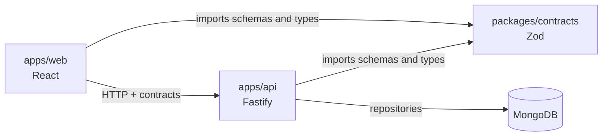

# Conjuros: Initial Guide

## 1. Product Vision

**Conjuros** is a personal web application for saving, organizing, and finding command shortcuts and related web links. The API is necessary, but the product is defined by a person's experience managing their collection in the frontend.

Each user can sign in and access only their collection items. A spell contains a command or tool configuration; a link contains a related URL. Both may include explanatory information and tags that enable quick classification and retrieval. Users can create, read, edit, delete, reorder, and copy their items with one click.

The first goal is not to build many endpoints: it is to let someone find the right spell or link and copy its exact text or open its URL quickly and confidently.

```text
Browser
   |
  |-- authentication and session
  |-- sortable collection list
  |-- search and filters
  |-- editing, deletion, and ordering
   v
TypeScript web application
  |-- React frontend
   |-- API Fastify
  |-- business rules
   v
MongoDB
```

## 2. Recommended Stack

- **Runtime:** Current Node.js LTS.
- **Language:** TypeScript 7 with `strict: true`. Until TypeScript 7 is stable for the selected ecosystem, use `typescript@next` and pin an exact version when compatible.
- **Frontend:** React and Vite. Use React Router for navigation and TanStack Query for remote data, caching, and invalidation.
- **Components and styling:** Custom CSS with design variables, or an accessible component library already selected by the team. The frontend should be functional and restrained before decorative.
- **Ordering:** `@dnd-kit` for drag and drop, with an accessible keyboard alternative.
- **API:** Fastify.
- **Persistence:** MongoDB using the official driver.
- **Shared validation:** Zod, reusing schemas and types between frontend and API when the monorepo allows it.
- **Authentication:** Secure sessions with `httpOnly` cookies or an identity provider. Do not store session tokens in `localStorage`.
- **Testing:** Vitest; React Testing Library for components; HTTP tests with `fastify.inject`; Playwright for critical flows.
- **API documentation:** OpenAPI through `@fastify/swagger`.
- **Local environment:** Docker Compose for MongoDB.
- **Quality:** ESLint, Prettier, Husky, and lint-staged.

## 3. Domain Model

The collection is the main aggregate. An item can be a spell or a web link; both have an owner, organization, order, and relationships in common. Design its rules and contracts first, then organize endpoints and screens around it.

### User

```ts
type User = {
  id: string;
  email: string;
  displayName: string;
  createdAt: Date;
};
```

### Collection Items

```ts
type CollectionItemBase = {
  id: string;
  ownerId: string;
  title: string;
  description?: string;
  tags: CollectionItemTag[];
  position: number;
  relatedItemIds: string[];
  createdAt: Date;
  updatedAt: Date;
};

type Spell = CollectionItemBase & {
  type: "spell";
  command: string;
};

type WebLink = CollectionItemBase & {
  type: "web-link";
  url: string;
};

type CollectionItem = Spell | WebLink;

type CollectionItemTag = {
  value: string;
  kind: "free" | "environment" | "shell" | "category";
};
```

Initial rules:

- Every collection item belongs to exactly one owner.
- A `spell` requires `command`, is kept as text, and is never executed by the application.
- A `web-link` requires `url`, which must be a valid absolute URL with an `https:` or `http:` protocol. The application only opens it after an explicit user action.
- `title` must describe the spell or link purpose and make it easier to find.
- `environment`, `shell`, and `category` tags are validated against defined catalogs. `free` tags may be normalized free text.
- `position` defines the common manual order of all items in each user's list.
- `relatedItemIds` may only include items owned by the same user and lets spells and links be related without duplicating attributes.
- The private list, search, reordering, and every edit are limited to the authenticated owner.

Do not store the order as an array of IDs inside the user: `position` per item supports pagination, filtering, and more direct updates. For the first MVP it can be an integer; when reordering, recalculate the affected positions in a validated operation. If the list becomes very large later, migrate to fractional positions.

Initial MongoDB indexes:

```text
collectionItems: { ownerId: 1, position: 1 }
collectionItems: { ownerId: 1, updatedAt: -1 }
collectionItems: { ownerId: 1, type: 1 }
collectionItems: { ownerId: 1, tags.value: 1 }
users: { email: 1 }, unique
```

## 4. Core Frontend Experience

The collection screen is the center of the product, not a secondary page after the API. It must show a clear mixed list of spells and links, visible search, and quick actions to copy, open, edit, and order.

Required flows:

1. **Sign in:** the user enters and sees only their collection items.
2. **Create spell:** enter a title, command, optional description, and tags. It appears in the collection after saving.
3. **Save link:** enter a title, URL, optional description, and tags. It can be related to one or more spells in the user's own collection.
4. **Read, copy, and open:** users can read the complete command or configuration and copy its exact text to the clipboard with one click. For a link, they can copy the URL or explicitly open it in a new tab. The interface immediately confirms whether a copy succeeded or failed.
5. **Search and filter:** search must match title, command, URL, description, and tags. Type, enumerated-tag, and free-text filters combine predictably.
6. **Order:** users can move items by drag and drop or keyboard; the common order is saved.
7. **Edit or delete:** users can change item fields or delete an item, with a clear confirmation before irreversible deletion.

### Search and Filters

Treat search and filters as explicit UI state, not as separate uncontracted fields. A useful initial state is:

```ts
type CollectionQuery = {
  text: string;
  types: CollectionItem["type"][];
  tags: string[];
  environments: string[];
  shells: string[];
  categories: string[];
  sort: "manual" | "updated" | "created" | "title";
};
```

Recommended behavior:

- `text` searches title, command, URL, description, and every tag.
- When used, the `types` filter limits results to spells, web links, or both.
- Values within one filter category use OR logic; different categories use AND logic.
- Manual ordering remains active only when no alternative sort is selected.
- Search is local only when the collection is already loaded and small; for large collections, the API paginates and filters in MongoDB.
- Filter state must be reflected in the URL so a view can reload or be saved without losing context.
- The frontend applies a short debounce to remote search and keeps a non-intrusive loading state.

### Design Criteria

- Prioritize density, fast reading, and repeated actions over a presentation page.
- Keep the search box available in the first visual block of the collection.
- Show commands or configurations in monospace, allow one-click copying, and do not truncate them without a way to view the full text.
- The copy button must use `navigator.clipboard`, copy only the stored `command` text without transforming it, and provide visible accessible confirmation. If the browser denies permission, provide a clear message and a way to select the text.
- Use tags as recognizable filter controls, not decorative text.
- For frequent actions, use familiar icons with a tooltip and accessible label: copy, open, edit, and delete.
- Dragging is not the only ordering method: provide keyboard controls and announce changes to screen readers.
- Explicitly design loading, empty collection, no-results search, and network-error states.
- Check desktop and mobile layouts; no text or control may overlap or require horizontal scrolling.

## 5. Project Structure

Start with a small monorepo to share types, validation, and configuration without duplication:

```text
Conjuros/
├── apps/
│   ├── web/                         # React + Vite
│   │   └── src/
│   │       ├── features/collection/
│   │       ├── features/auth/
│   │       ├── routes/
│   │       └── components/
│   └── api/                         # Fastify
│       └── src/
│           ├── modules/collection/
│           ├── modules/auth/
│           ├── config/
│           └── shared/
├── packages/
│   └── contracts/                   # Shared Zod schemas and types
├── tests/
│   └── e2e/
├── docs/
├── .github/
│   ├── agents/
│   ├── instructions/
│   ├── skills/
│   └── workflows/
├── .vscode/
├── AGENTS.md
├── compose.yaml
├── package.json
└── .env.example
```

Responsibilities must remain separate:

- `apps/web` renders the experience, maintains UI state, and consumes contracts; it does not know MongoDB.
- `apps/api` authorizes requests, applies business rules, and accesses MongoDB through repositories.
- `packages/contracts` contains shared contracts: inputs, outputs, enums, and Zod schemas. It must not contain database logic or React components.

The separation looks like this:



## 6. Technical Setup

In the VS Code integrated terminal:

```bash
git init
npm init -y
npm install -D typescript@next tsx vitest eslint prettier @types/node
npm install -D vite @vitejs/plugin-react @types/react @types/react-dom
npm install fastify mongodb zod dotenv
npm install react react-dom react-router @tanstack/react-query @dnd-kit/core @dnd-kit/sortable
npx tsc --init
```

Once each application has its `package.json`, root scripts should validate the whole project:

```json
{
  "scripts": {
    "dev": "npm run dev --workspaces",
    "build": "npm run build --workspaces",
    "test": "npm run test --workspaces",
    "lint": "npm run lint --workspaces",
    "format": "prettier --write .",
    "check": "npm run build && npm run lint && npm run test"
  }
}
```

For local MongoDB, use `compose.yaml`:

```yaml
services:
  mongo:
    image: mongo:8
    ports:
      - "27017:27017"
    environment:
      MONGO_INITDB_DATABASE: conjuros
    volumes:
      - mongo-data:/data/db

volumes:
  mongo-data:
```

```bash
docker compose up -d
```

Include `.env.example`, but never commit `.env` or secrets:

```env
API_PORT=3000
WEB_PORT=5173
MONGODB_URI=mongodb://localhost:27017
MONGODB_DATABASE=conjuros
SESSION_SECRET=replace-with-a-local-secret
```

## 7. Configure VS Code

Essential extensions:

- **ESLint**
- **Prettier**
- **Docker**
- **MongoDB for VS Code**
- **GitHub Copilot** and **GitHub Copilot Chat**
- **Playwright Test for VS Code**
- **REST Client** or **Thunder Client**

Initial `.vscode/settings.json` configuration:

```json
{
  "editor.formatOnSave": true,
  "editor.codeActionsOnSave": {
    "source.fixAll.eslint": "explicit"
  },
  "eslint.validate": ["typescript", "typescriptreact"],
  "files.exclude": {
    "dist": true,
    "coverage": true
  }
}
```

Create VS Code tasks to start the API, frontend, MongoDB, tests, and linting. This gives people and agents the same verifiable commands.

## 8. AGENTS.md: Global Repository Rules

`AGENTS.md` should express cross-cutting, verifiable, and stable rules. It should not duplicate implementation details that belong in an area instruction or skill. This is a suitable starting point:

```md
# Conjuros Instructions

## Product
Conjuros lets authenticated users manage a private collection of items. An item is
either a `spell` with a `command` or a `web-link` with a `url`; both have an owner,
title, description, tags, order, and relationships.

## Domain Rules
- On private routes, verify that an item belongs to the authenticated user before reading, updating, reordering, or deleting it.
- A `spell` requires `command`; store and display its exact text, and never execute it.
- A `web-link` requires an absolute `https:` or `http:` URL; only open it after an explicit user action.
- `relatedItemIds` may only refer to items owned by the same user.
- Validate enumerated tags against their catalogs; normalize and validate free-form tags.

## Architecture
- Use strict TypeScript; do not use `any`.
- Validate all inputs at boundaries with Zod.
- The HTTP layer contains no business rules.
- Services do not depend on Fastify, React, or MongoDB.
- Only repositories access MongoDB.
- Share Zod schemas and types through `packages/contracts` when both web and API use them.
- Do not duplicate contracts or expose persistence-only fields in public contracts.

## Frontend
- Prioritize search, reading, and quick actions for collection items.
- Every visible `spell` has an accessible action to copy the exact `command` text and report success or failure.
- Every visible `web-link` has accessible actions to copy its URL and explicitly open it.
- The common ordering must work with pointer and keyboard input, and must persist.
- Include loading, empty, no-results, and error states.
- Do not add components, libraries, or animations without a specific need.

## Security and Quality
- Do not store secrets or real `.env` values.
- Do not expose internal identifiers, other users' data, or sessions.
- Every feature includes risk-proportionate tests and updates contracts or OpenAPI when needed.
- Before finishing, run the most specific available validation and `npm run check` when it exists; report any unresolved failures.
```

## 9. Agents, Instructions, and Skills

There is no need to multiply agents. Create four roles with clear boundaries and use `AGENTS.md` for cross-cutting rules.

```text
.github/
├── agents/
│   ├── collection-feature.agent.md
│   ├── frontend-experience.agent.md
│   ├── test-reviewer.agent.md
│   └── security-reviewer.agent.md
├── instructions/
│   └── frontend.instructions.md
└── skills/
    ├── collection-domain/
    │   └── SKILL.md
    └── frontend-workflow/
        └── SKILL.md
```

Responsibilities:

- **`collection-feature`**: implements vertical changes for spells and web links, including contracts, API, persistence, and associated tests.
- **`frontend-experience`**: implements and reviews screens, search, filters, ordering, accessibility, states, and frontend tests. It does not modify authorization rules or MongoDB schemas without an explicit requirement.
- **`test-reviewer`**: finds domain edge cases and filter, ordering, and permission regressions.
- **`security-reviewer`**: reviews authentication, user isolation, secrets, validation, and destructive operations.
- **`collection-domain` skill**: gathers stable rules for collection items, tags, order, relationships, and ownership permissions.
- **`frontend-workflow` skill**: contains the process for implementing and verifying UI changes with React, Vitest, and Playwright.

### Specialized Frontend Agent

Create `.github/agents/frontend-experience.agent.md` with this baseline. The YAML header must be valid; its `description` field lets VS Code discover when to use it.

```md
---
name: frontend-experience
description: "Implements and reviews the Conjuros React experience: lists, search, filters, editing, accessible ordering, and frontend tests. Use it for visual, interaction, or accessibility changes in apps/web."
tools: ["read", "search", "edit", "execute"]
---

# Frontend Experience Agent

Work primarily in `apps/web/**` and in already agreed contracts.

## Priorities
- The collection and its search are the primary experience.
- Keep frequent actions near each item: copy, open when applicable, edit, and delete.
- One-click `command` copying is critical: preserve the exact text, confirm the result, and provide an alternative when the clipboard is unavailable.
- For a `web-link`, allow copying the exact URL and open it only through an explicit action.
- Keep the URL as the source of truth for search, filters, and selected ordering.
- Use accessible components and semantic controls. Icons require a tooltip and accessible label.
- Drag-and-drop ordering requires a keyboard alternative and screen-reader announcements.
- Implement loading, empty, no-results, insufficient-permission, and network-error states.

## Boundaries
- Do not access MongoDB directly or introduce secrets in the frontend.
- Do not duplicate API contracts: import available shared schemas and types.
- Do not alter authorization or API contracts without coordinating the domain change.
- Do not replace existing components or add UI dependencies without justifying them in the summary.

## Validation
- Add or update component tests for changed states and actions, including successful copying and clipboard errors when that interaction changes.
- Run frontend linting and tests.
- For critical-flow changes, add or update a Playwright test to create, search, or reorder a collection item.
- Check mobile and desktop sizes; no control or text may overlap or become inaccessible.
```

As a rule, keep this agent in `.github/agents/` because it is project-specific and shareable. Do not put its rules in `AGENTS.md` if they apply only to the frontend: global instructions should remain brief.

### Frontend Instructions

Use `.github/instructions/frontend.instructions.md` for rules loaded while editing frontend files. Use a specific pattern, not `**`, to avoid loading backend-task context:

```md
---
applyTo: "apps/web/**/*.{ts,tsx,css}"
description: "React conventions and user-experience guidance for the Conjuros web application."
---

# Frontend Conventions

- Use strict TypeScript and small components focused on one responsibility.
- Separate remote data, URL state, and local presentation state.
- Use TanStack Query for remote calls, caching, and invalidation.
- Keep filters and search serialized in the URL.
- Use `@dnd-kit` for ordering; always implement the keyboard equivalent.
- Do not hide a long command without a way to view and copy it fully with one click.
- Copy the exact `command` value through `navigator.clipboard`; report success or error and allow text selection as an alternative.
- Add tests for search, filters, and list states when their behavior changes.
```

### Initial Skills

A skill groups knowledge applied on demand, not global rules. Example for `.github/skills/collection-domain/SKILL.md`:

```md
---
name: collection-domain
description: "Use when implementing or changing spells, web links, tags, relationships, manual ordering, or ownership permissions."
---

# Collection Domain

- Every item has an owner and private routes must verify it before operating.
- A `spell` has `command`, which is stored and displayed without ever being executed.
- A `web-link` has an absolute `https:` or `http:` URL and opens only after an explicit action.
- Enumerated tags are validated against catalogs and free-form tags are normalized.
- Manual ordering is based on `position` per user.
- Relationships only link items owned by the same user.
- Include tests for ownership, invalid IDs, and missing resources.
```

## 10. MCP and Development Harness

MCP connects Copilot to external tools. Enable only the ones that cover a specific need:

- **GitHub MCP:** issues, pull requests, and reviews.
- **MongoDB MCP:** controlled inspection of development collections, indexes, and data.
- **Playwright MCP:** inspection and testing of frontend flows.
- **Context7 MCP:** current documentation for React, Fastify, MongoDB, Zod, and installed libraries.

MCP rules:

- Connect MongoDB MCP only to local or development instances at first.
- Use least-privilege credentials and keep secrets out of versioned files.
- Ask for confirmation before deletions, destructive migrations, or bulk data changes.
- Do not enable MCP servers without a concrete use case.

The harness is the loop that turns AI use into repeatable development:

```text
Input
- An issue or story with a user flow and acceptance criteria.

Implementation
- Update contracts and domain rules when necessary.
- Implement API, persistence, and/or UI within its ownership boundary.
- Add risk-proportionate tests.
- Verify that copying a spell or link preserves the exact text and communicates the result to the user.

Verification
- npm run build
- npm run lint
- npm run test
- Playwright tests for critical frontend flows.

Output
- Change summary and affected files.
- Validation commands run and their results.
- Risks, decisions, or remaining work.
```

An agent is not finished when it generates code; it is finished after checking it and reporting the result.

## 11. Implementation Order

Build vertically, starting with a small experience that works end to end:

1. Configure the monorepo, local MongoDB, strict TypeScript, linting, and tests.
2. Create `GET /health` and the React skeleton with a protected collection route.
3. Implement registration, sign-in, sign-out, and per-user data isolation.
4. Define Zod contracts and the collection module: create, list, get, edit, and delete spells and web links.
5. Build the collection screen: reading, copying commands and URLs, and creating or editing items.
6. Implement combinable search and filters while retaining state in the URL.
7. Add accessible manual ordering and position persistence.
8. Add API integration, component, and Playwright tests for sign-in, CRUD, search, and ordering.
9. Publish OpenAPI, configure CI with `npm run check`, structured logs, and health/readiness checks.

## 12. First Copilot Prompt

Once the structure, `AGENTS.md`, and base contracts exist, use a prompt focused on the complete flow:

```text
Read AGENTS.md and applicable instructions. Implement the first vertical Conjuros flow:

- An authenticated user can create a spell with a title, command, optional description, and tags.
- They can list only their own spells.
- The collection screen shows title, tags, and command, and lets users copy the exact `command` value to the clipboard with one click, with success or error confirmation.
- Validate inputs with shared Zod contracts.
- Add HTTP tests for ownership, invalid data, and the correct flow.
- Add frontend tests for the empty collection, creation, and copying.
- Run available validations and summarize the results.
```

## First Concrete Milestone

The first milestone is a working private collection: registration or sign-in, creation, listing, reading, and reliable one-click copying of the exact text of every command or URL; MongoDB in Docker; a React frontend; Zod validation; tests; and documented agent rules. Advanced search and ordering are added on that base, while keeping quick retrieval of every item at the heart of the product.
