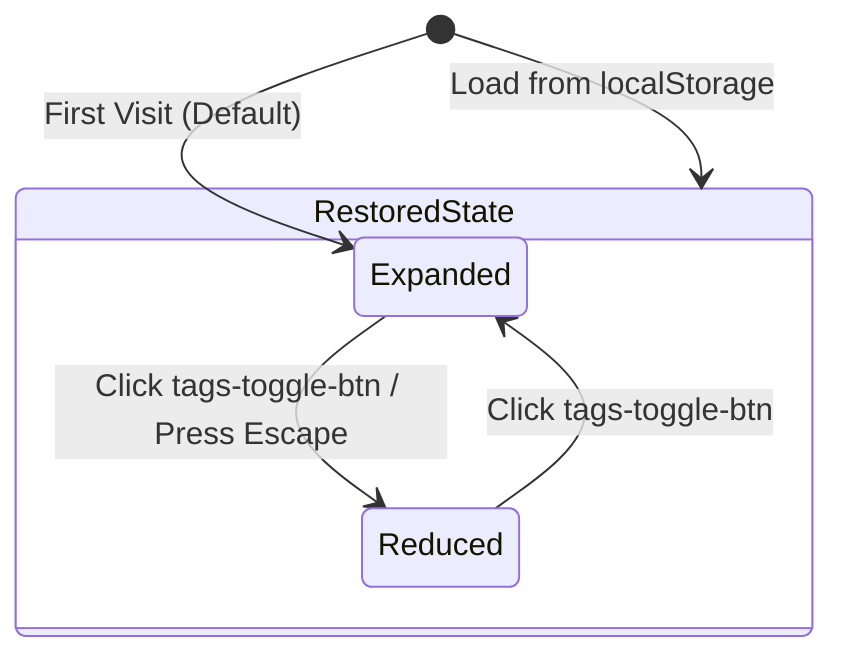

# Phase 1 Data Model: Sidebar Collapse & Expand Mechanics

**Feature**: 016-sidebar-collapse
**Date**: 2026-08-02

## UI Entities

### SidebarState (Client Layout State)

Client-side state tracking the expanded vs reduced state of the tags sidebar panel.

| Property | Type | Default | Description |
|---|---|---|---|
| `isSidebarOpen` | `boolean` | `true` (if un-set) | `true` when fully expanded showing all tags; `false` when reduced to compact toggle button |
| `storageKey` | `string` | `"conjuros_sidebar_open"` | `localStorage` key used to persist state across sessions |

### State Transitions

## Validation & Rules

1. **State Persistence**: On any state change, `localStorage.setItem('conjuros_sidebar_open', String(nextState))` MUST be called.
2. **Keyboard Trapping Avoidance**: In `Reduced` state, only the `tags-toggle-btn` inside the sidebar remains focusable.
